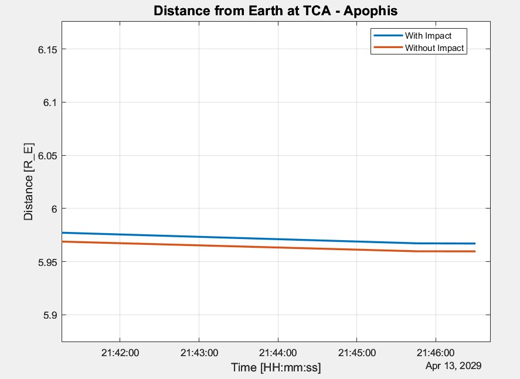
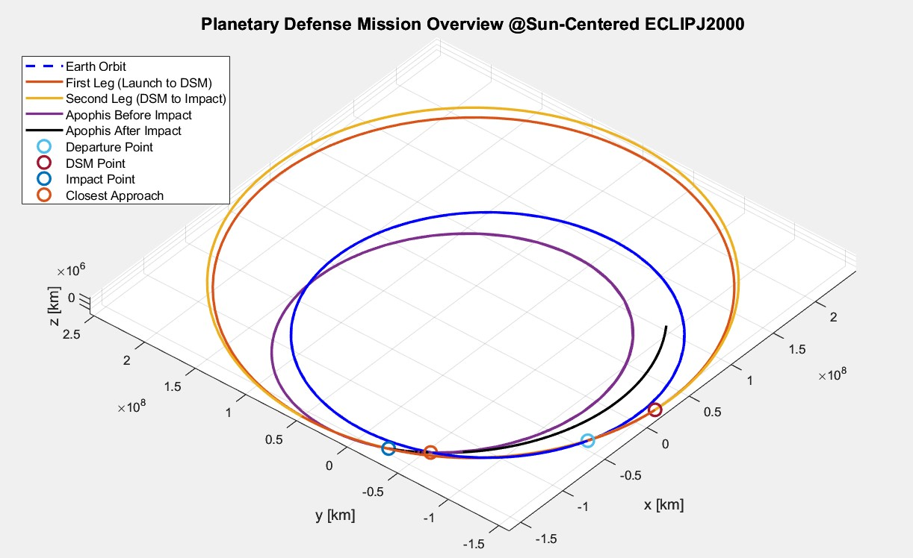

## README: Apophis Planetary Defense Mission Optimization  

This repository contains the MATLAB script (MultipleShooting_fmincon.m) used for optimizing a kinetic impactor mission to deflect the Apophis (20099942) asteroid.  
The optimization employs the Multiple Shooting Method and Parametric Time Variables ($\alpha_0, \alpha_1, \text{TOF}$) to solve a complex interplanetary trajectory problem;  
 aiming to maximize the miss distance from Earth at the Time of Closest Approach (TCA) while minimizing the mission's required $\Delta V$.  

## Requirements
MATLAB R2018b or newer  
Optimization Toolbox: Required for the fmincon solver.  
SPICE Toolkit (Mice for MATLAB): Essential for all ephemeris and astronomical calculations.  
Custom N-Body Functions: External functions (nbody_init, nbody_rhs)  

## ️Operating Principle and Optimization Flow  
The script uses fmincon (configured with the active-set algorithm) to iteratively search for the optimal trajectory.  
1. Initialization and SetupData Loading: SPICE kernels (LSK, SPK, PCK) for Earth, Moon, Sun, and Apophis are loaded.  
Mission Constants: Physical parameters are defined, including  
Asteroid Mass ($M_{\text{ast}}$)  
Specific Impulse ($I_{\text{sp}}$)  
Momentum Enhancement Factor ($\beta$)  
Time Windows: Mission time constraints are established: Launch Window ($LWO, LWC$) and Impact Window (IMPS, IMPF).  

2. Decision Variables (19 Total)The optimization vector $\mathbf{X}$ is composed of three main groups:  
Variables,Count,Description,"Example Range (LB - Lower Bound,UB - Upper Bound)"  
Time Parameters: "α0​ (Launch time fraction), α1​ (DSM time fraction), TOF (Total Flight Time)."  
αi​∈[0,0.9]  
TOF∈[1000,2000] days  
Launch Parameters: Spherical Angles angles (α,δ)  
Launch Delta -V Δv0​∈[1.5,5.5] km/s  
Initial S/C mass msc0​∈[100,3000] kg  
Multiple Shooting Node: State vectors:  $\mathbf{x}_2$ (at DSM) and  $\mathbf{x}_3$ (at Impact).  
Bounded by solar system dimensions (±Rl​) and max velocity (±100 km/s).  

3. Objective and Constraints  
 
A. Objective Function (objFunMultipleShoot_parametric_alpha)  
The goal is to maximize the TCA distance ($d_{\text{TCA}}$) between the deflected asteroid and Earth.  
$$\min \left[ f(\mathbf{X}) = -d_{\text{TCA, after impact}} \right]$$  
The function calculates the fuel consumption ($\Delta v_2$), determines the impact mass , and computes the dynamic momentum coefficient,   
 and finally propagates the resulting post-impact asteroid trajectory to find the actual minimum distance to Earth.  

B. Nonlinear Constraints (nonlinconstMultipleShoot_parametric_alpha)
These constraints, vital for the Multiple Shooting method, ensure the physical and operational feasibility of the solution:

1. **Trajectory Continuity**  
   Ensures the propagated state from $\mathbf{x}_1$ meets $\mathbf{x}_2$, and $\mathbf{x}_2$ meets $\mathbf{x}_3$.  
2. **Asteroid Match**  
   Enforces that the spacecraft's final position $\mathbf{x}_{3,1:3}$ exactly matches Apophis' position at $t_{\text{IMP}}$.  

Inequality Constraints (`c`)  
1. **ΔV Budget**  
   Restricts total ΔV to be less than 5 km/s:  
   $$\Delta v_0 + \Delta v_{\text{DSM}} \le 5 \text{ km/s}$$  

2. **Timing Check**  
   Ensures $t_0$ and $t_{\text{IMP}}$ adhere to the mission windows.  

## Outputs and Post-Processing  
The postprocess_parametric_alpha function generates a comprehensive report of the optimized mission:  
Mission Times: Optimal Launch, DSM, Impact, and Final TCA dates.  
Budget Summary: Initial/Impact Mass, Fuel Consumed, Dynamic Momentum Coefficient, and total $\Delta V$ utilization.  
Mission Outcome: The final TCA distance, measured in Earth Radii ($\text{R}_{\text{E}}$), and the percentage improvement over the natural trajectory.  

## Results
Visualization:Distance Plots: Plots comparing the distance from Earth and Moon over time for the deflected vs. natural asteroid trajectories around TCA.  
  

3D Trajectory Plot: A visualization of the entire mission, showing the Earth's orbit, the spacecraft's two legs (Launch to DSM, DSM to Impact), and the asteroid's path before and after deflection.  

